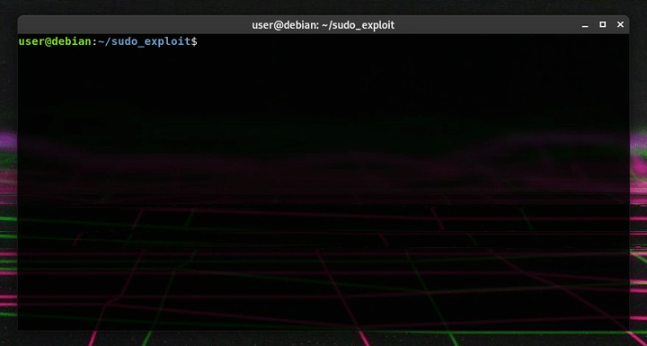

# CVE-2021-3156
CVE-2021-3156: Sudo heap overflow exploit for Debain 10 

Full article: https://syst3mfailure.io/sudo-heap-overflow

Currently tested on:

- Sudo:

        Version 1.8.27 (1.8.27-1+deb10u1)
        Checksum (sha256): b83f8f4e763ae9860f1e3bde7f6cc913da51ceccc31d84c1cca2f86ac680e1de

        Version 1.8.27 (1.8.27-1+deb10u2)
        Checksum (sha256): ca4a94e0a49f59295df5522d896022444cbbafdec4d94326c1a7f333fd030038
        
- Glibc:

        Version 2.28
        Checksum (sha256): dedb887a5c49294ecd850d86728a0744c0e7ea780be8de2d4fc89f6948386937

- Debain 10:

        Linux debian 4.19.0-10-amd64 #1 SMP Debian 4.19.132-1 (2020-07-24) x86_64 GNU/Linux
        Linux debian 4.19.0-13-amd64 #1 SMP Debian 4.19.160-2 (2020-11-28) x86_64 GNU/Linux
        Linux debian 4.19.0-14-amd64 #1 SMP Debian 4.19.171-2 (2021-01-30) x86_64 GNU/Linux
